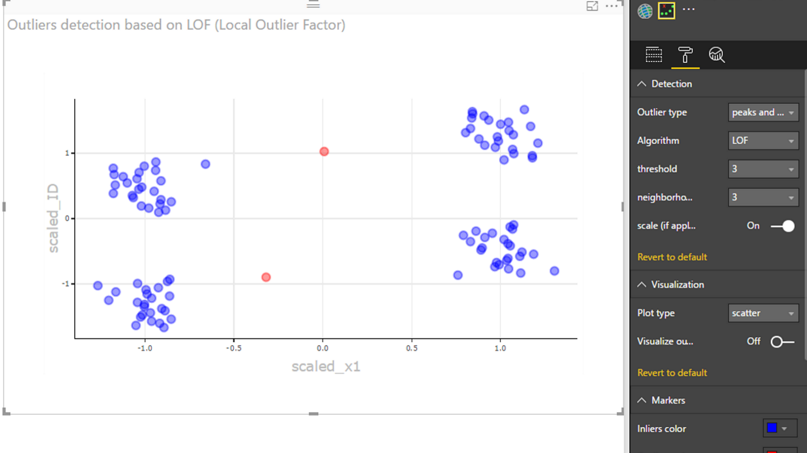
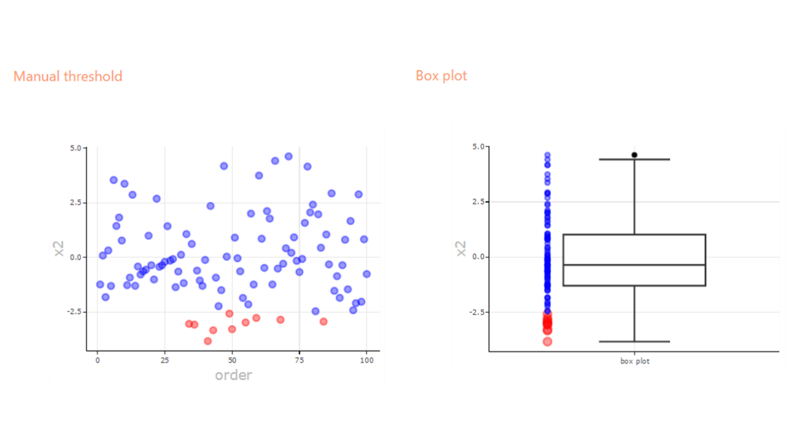

# Outliers Detection

An outlier is an observation, such as a data point, that exists a significant distance from most other observations. 

Outliers sometimes occur due to measurement errors. Other times, outliers can be indicators of important occurrences or events.
One such example is fraud detection, where outliers may indicate fraudulent activity. 
As such, outlier detection and analysis is an interesting and challenging data mining task.
 

There are many different methods to detect outliers.  In this Custom Visual, we implement five very popular detection methods: 

1. Zscore is a standard deviation approach. For more details see: https://en.wikipedia.org/wiki/Standard_score
2. Tukey’s method, which uses interquartile (IQR) range approach. For more details see: http://datapigtechnologies.com/blog/index.php/highlighting-outliers-in-your-data-with-the-tukey-method/
3. LOF (Local Outlier Factor) method, which computes the local density deviation of a given data point with respect to its neighbors. It considers samples that have a substantially lower density than their neighbors as outliers. For more details see: https://en.wikipedia.org/wiki/Local_outlier_factor
4. Cook's distance, which shows the influence of each observation on the fitted response values. An observation with Cook's distance larger than three times the mean Cook's distance might be an outlier. For more details see: https://en.wikipedia.org/wiki/Cook%27s_distance
5. Finally, the manual method allows you to define your own upper and lower thresholds for the original data.

In addition to those methods, we support three ways to visualize outliers: 
* Scatter plot 
* Box plot
* Density plot

For each plot type, you can decide to visualize the original data, or outlier scores. 

NEW: support for tooltips on hover and selection.

Here is how it works: 
* Define required fields to be analyzed in the plot. At least one numeric column of "Variables" for all detection methods and at least one numeric column for "Independent Variables" for Cook's detection method. 
* Avoid using multivariate inputs where possible, otherwise the results will not always be interpretable
* Optionally, define a unique ID field (highly recommended to avoid duplicates removal) 
* Optionally, provide the fields to be shown in tooltips upon hover 
* Select one of the detection methods, or use the default
* Use detection parameters such as thresholds to refine the characteristics of outliers
* Use numerous formatting controls to refine the visual appearance of the plot

R package dependencies (which are auto-installed): scales, reshape, ggplot2, plotly,  htmlwidgets, XML, DMwR
Supports R versions: R 3.4.1, R 3.3.3, R 3.3.2, MRO 3.2.2 

# Contributing

This project welcomes contributions and suggestions.  Most contributions require you to agree to a
Contributor License Agreement (CLA) declaring that you have the right to, and actually do, grant us
the rights to use your contribution. For details, visit https://cla.microsoft.com.

When you submit a pull request, a CLA-bot will automatically determine whether you need to provide
a CLA and decorate the PR appropriately (e.g., label, comment). Simply follow the instructions
provided by the bot. You will only need to do this once across all repos using our CLA.

This project has adopted the [Microsoft Open Source Code of Conduct](https://opensource.microsoft.com/codeofconduct/).
For more information see the [Code of Conduct FAQ](https://opensource.microsoft.com/codeofconduct/faq/) or
contact [opencode@microsoft.com](mailto:opencode@microsoft.com) with any additional questions or comments.

